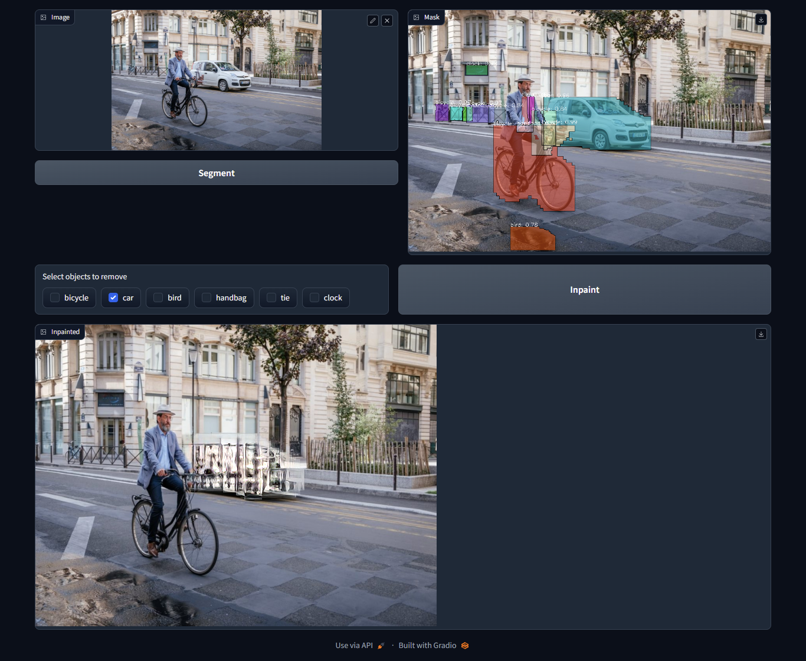

# QuickPainter

A simple inpainting app utilizing OpenVINO to remove common objects from images.

It uses [instance-segmentation-security-1040](https://github.com/openvinotoolkit/open_model_zoo/tree/master/models/intel/instance-segmentation-security-1040#instance-segmentation-security-1040) model from Open Model Zoo for instance segementation and [gmcnn-places2-tf](https://github.com/openvinotoolkit/openvino_notebooks/tree/main/notebooks/215-image-inpainting) for inpainting.



## Usage

1. Install dependencies

    ````bash
    pip3 install -r requirements.txt
    ````

2. Run the app

    ````bash
    python3 app.py
    ````
